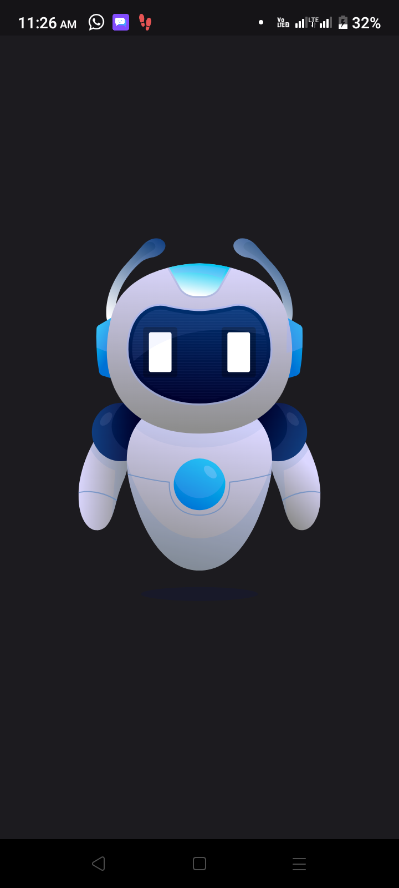
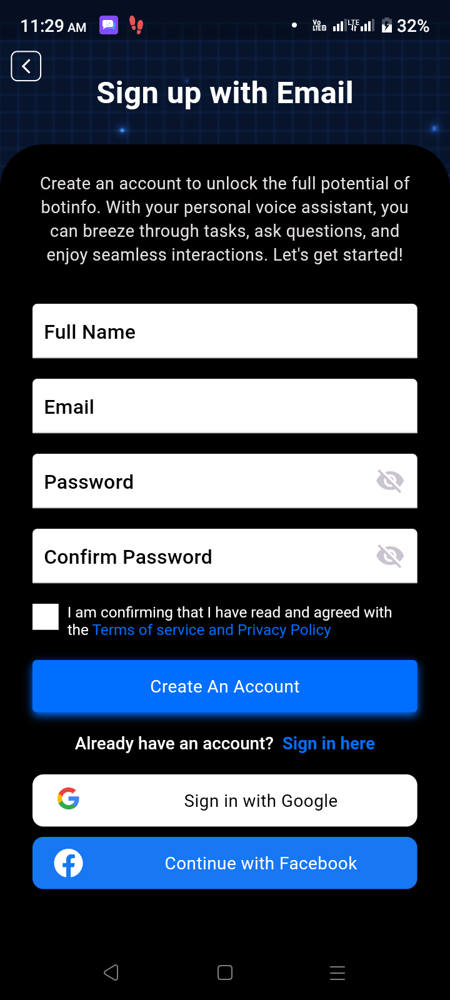
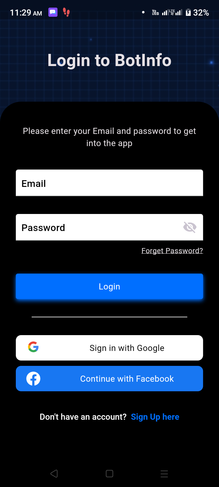
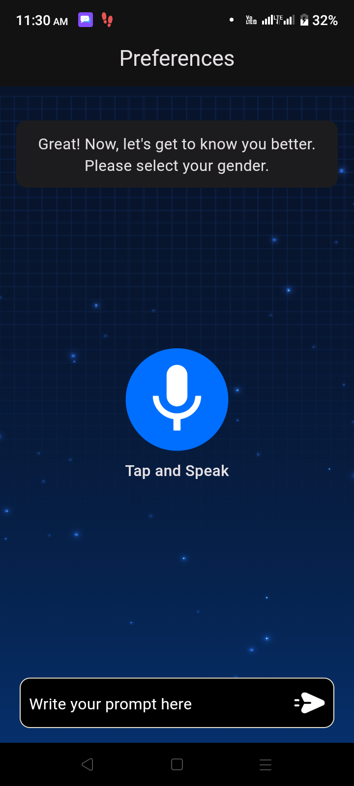
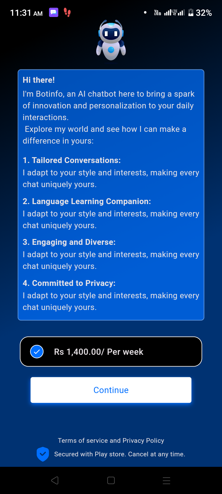

# Botinfo

INTRODUCTION

BOTINFO is at the forefront of conversational AI, revolutionizing the way we interact with technology. Our cutting-edge system harnesses the power of artificial intelligence to bring you a personal voice assistant like no other. With BOTINFO, you can effortlessly complete tasks, find information, and engage in natural conversations, all through the convenience of voice commands. Experience a new era of user-friendly, hands-free technology with BOTINFO.

KEY FEATURES
1. Users can interact with BOTINFO using natural language voice commands, making tasks easier and more convenient.
2. BOTINFO can provide answers to a wide range of questions, from weather updates to general knowledge queries.
3. Advanced voice recognition technology ensures accurate interpretation of user commands.

TECHNOLOGIES & TOOLS USED

1. Open AI GPT 4 turbo
2. Open ai Speech Studio
3. Whisper
4. Multiple language support
5. Firebase
6. Flutter

SCREENSHOTS

    

INSTALLATION LINK:

https://play.google.com/store/apps/details?id=com.botinfo
